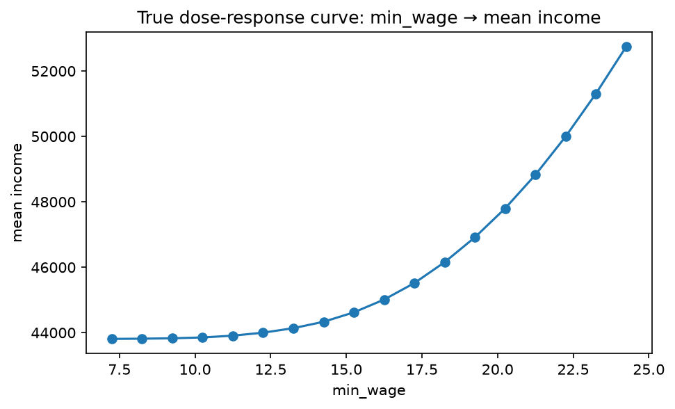
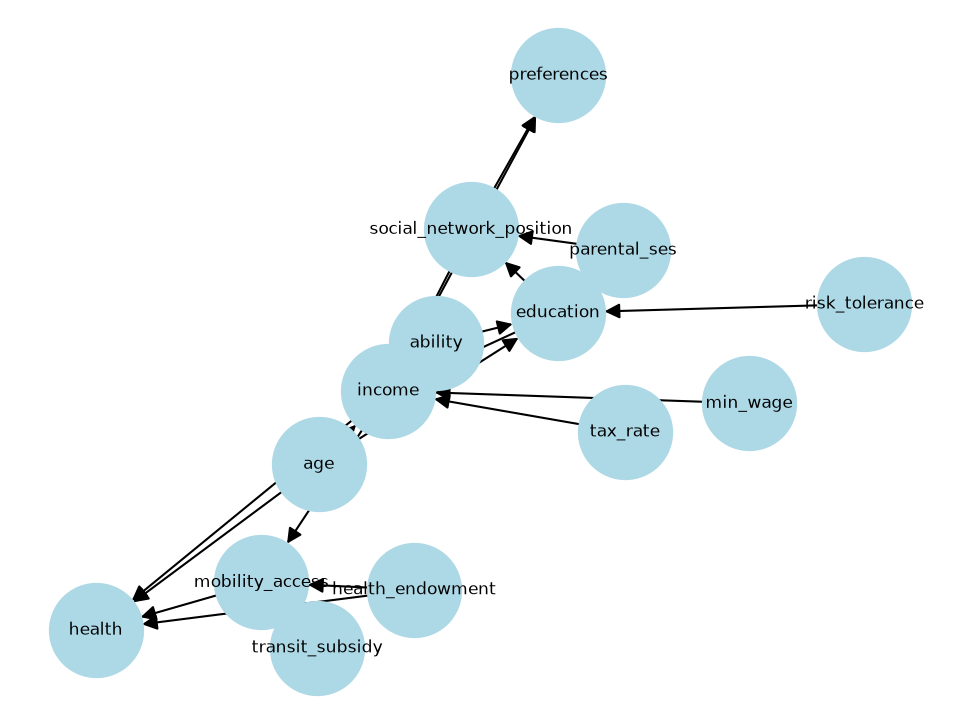

# Direct Intervention Effects: What Does Raising the Minimum Wage Actually Do?

**Status:** ☑ complete
**Scripts:** [`minimum_wage_effect.py`](./minimum_wage_effect.py) ·
[`policy_sensitivity_tornado.py`](./policy_sensitivity_tornado.py) ·
[`subgroup_effects_by_education_age.py`](./subgroup_effects_by_education_age.py)

## Objective

Because Synth City is a known structural causal model, we don't have to *estimate* the
effect of a policy change — we can generate the same population twice, once under each
policy, and read off the true effect directly. This write-up walks through that effect
from four angles: the raw distribution shift, how it scales with the size of the wage
increase, how it propagates through the rest of the causal graph, and — most importantly —
who it actually reaches.

## Method

- **Population:** n = 5,000 (n = 20,000 for the subgroup breakdown, to keep subgroup means stable), seed = 0
- **Intervention:** `do(min_wage=15.0)` vs. the default policy (`min_wage=7.25`)
- **Stability check:** the headline ATE is also re-estimated across 20 seeds to establish
  a noise floor — see Headline numbers

## Key results

### 1. Income distribution shift


The whole distribution shifts right, not just the floor — income has noise on top of the
wage floor, so the effect isn't a clean truncation, it's a genuine mean shift.

### 2. Dose-response curve



Sweeping `min_wage` from $7.25 to $24 shows a close-to-linear relationship in this range,
flattening once the floor stops binding for most of the population.

### 3. Propagation through the causal graph




`min_wage` (gold) is the intervened node. `income` (its direct child) shows the largest
standardized effect; `mobility_access` and `health` (two hops downstream) show smaller
effects; upstream nodes (`education`, `ability`, `parental_ses`) show essentially zero, as
they should — nothing in a valid causal DAG flows backward against causal order, so this
doubles as a correctness check on the SCM itself.

### 4. Which lever matters most


Compared against the city's other two levers, `tax_rate` moves mean income roughly 5x more
than the full `min_wage` range does; `transit_subsidy` has zero effect on income (correct
by construction — it only feeds `mobility_access`, not `income`, in the SCM).

### 5. Who actually benefits


The effect is **entirely concentrated** in people without a college degree (the wage floor
only binds for people near it) and fades sharply with age (income rises with experience in
this model, pushing older workers further above the floor regardless of education).

## Headline numbers

| Metric | Value |
|---|---|
| True ATE (single sample, n=5,000) | $730.58 |
| True ATE (averaged over 20 seeds) | **$742.85 ± $23.51** |
| Swing in mean income, full `tax_rate` range | $19,256 |
| Swing in mean income, full `min_wage` range | $3,632 |
| ATE, no-degree subgroup | $1,016 |
| ATE, bachelor's/graduate subgroup | $0 |
| ATE, age 18-30 | $1,654 |
| ATE, age 60-75 | $161 |

## Interpretation

Reporting the single aggregate ATE ($743) would be technically correct and substantively
misleading on its own: it implies a modest, uniform effect, when the real story is a large
effect concentrated entirely in young, lower-education workers and zero effect on everyone
else. It also isn't the most powerful lever available — tax rate moves income roughly 5x
more per unit of policy range swept. The practical takeaway for a policymaker optimizing for
income alone: tax rate is the bigger lever, but minimum wage is the more *targeted* one.

## Reproduce

```bash
python quantitative_analysis/causal-inference/direct-intervention-effects/minimum_wage_effect.py
python quantitative_analysis/causal-inference/direct-intervention-effects/policy_sensitivity_tornado.py
python quantitative_analysis/causal-inference/direct-intervention-effects/subgroup_effects_by_education_age.py
```
