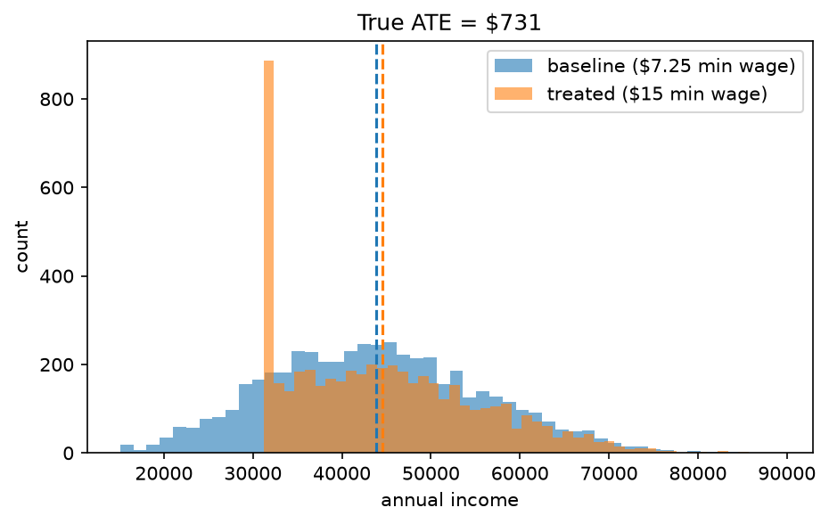
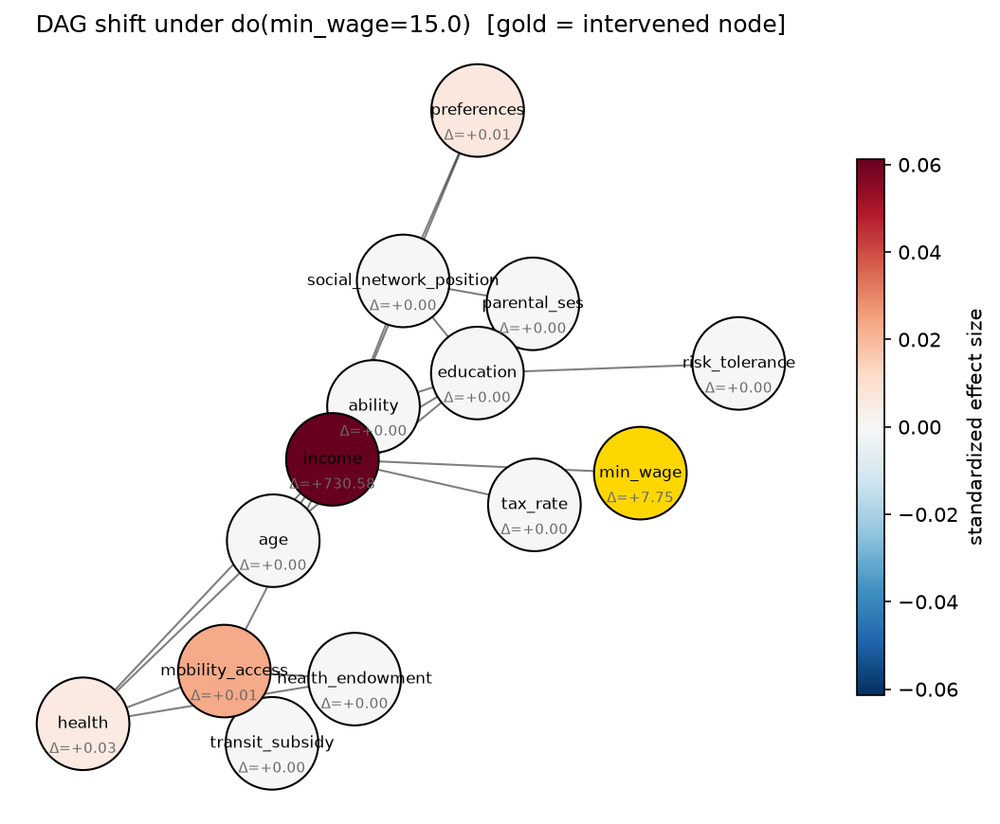

# Ground-Truth Effect of a Minimum Wage Increase

**Status:** ☑ complete
**Date:** 2026-08-03
**Notebook:** [`notebook.ipynb`](./notebook.ipynb)

## Objective

Synth City lets us know the *true* causal effect of a policy change, because we generated
the population ourselves. This experiment asks: what is the ground-truth effect of raising
the minimum wage from $7.25 to $15.00 on income — and how far does that effect propagate
through the rest of the causal graph (mobility, health)?

This is also the baseline every Stage 2 estimator (propensity scores, IPTW, causal forests,
DML) gets graded against in later experiments — this notebook produces the number they're
trying to recover from observational data alone.

## Method

- **Population:** n = 5,000, seed = 0
- **Intervention:** `city.do(min_wage=15.0)`, compared against the default policy (`min_wage=7.25`)
- **Ground truth stability:** re-estimated across 20 seeds to get a noise floor on the ATE
  (see Headline numbers)

## Key results

### Income distribution shift



Raising the minimum wage shifts the entire income distribution right, not just the floor —
because income has noise on top of the wage floor, the effect isn't a clean truncation, it's
a genuine mean shift.

### Dose-response curve


Sweeping `min_wage` from $7.25 to $24 and re-sampling at each level shows the relationship is
close to linear in this range, then flattens once the wage floor stops binding for most of the
population — i.e. once `min_wage * 2080` falls below what most people would earn anyway.

### Effect propagation through the DAG



`min_wage` (gold) is the intervened node. Effect size fades as it propagates downstream:
`income` (direct child) shows the largest standardized shift, `mobility_access` and `health`
(two hops downstream) show smaller shifts, and upstream nodes (`education`, `ability`,
`parental_ses`) show ~zero effect — as they should, since nothing in a valid causal DAG
flows backward against the causal order. This is a useful correctness check on the SCM
itself, not just a result.

## Headline numbers

| Metric | Value |
|---|---|
| True ATE (mean income, single sample, n=5,000) | +$730.58 |
| True ATE (averaged over 20 seeds) | *fill in from your run* |
| Noise floor (std across seeds) | *fill in from your run* |

## Interpretation

The effect on income is positive and, at this wage range, roughly proportional to the size
of the wage increase. The effect on health and mobility is real but meaningfully smaller —
which makes sense, since those nodes only receive the income shock filtered through a small
structural coefficient rather than experiencing it directly. This propagation pattern is the
thing worth checking most carefully once Stage 3 replaces these fixed equations with learned
behavioral models: a good behavioral model should reproduce this same fade-with-distance
pattern, not amplify or invert it.

## Reproduce

```bash
jupyter lab quantitative_analysis/causal-inference/minimum-wage-effect/notebook.ipynb
```
