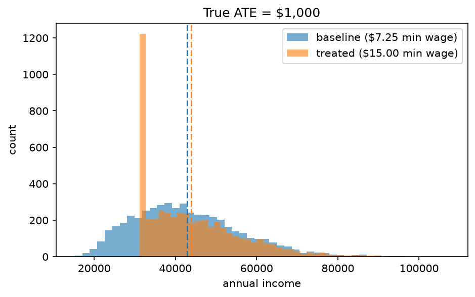
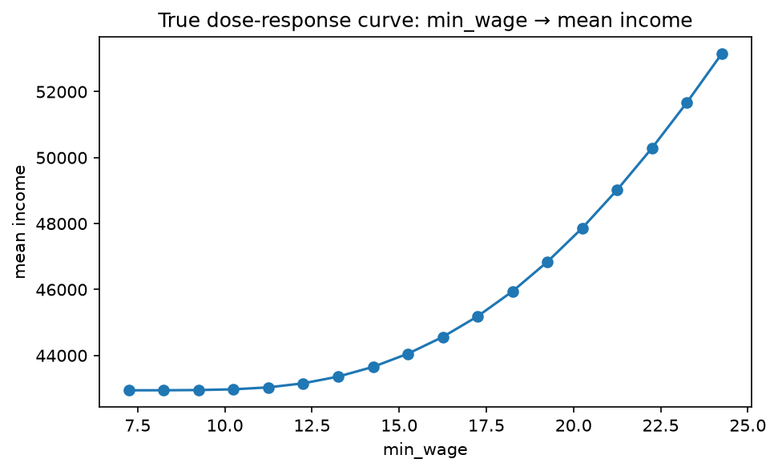
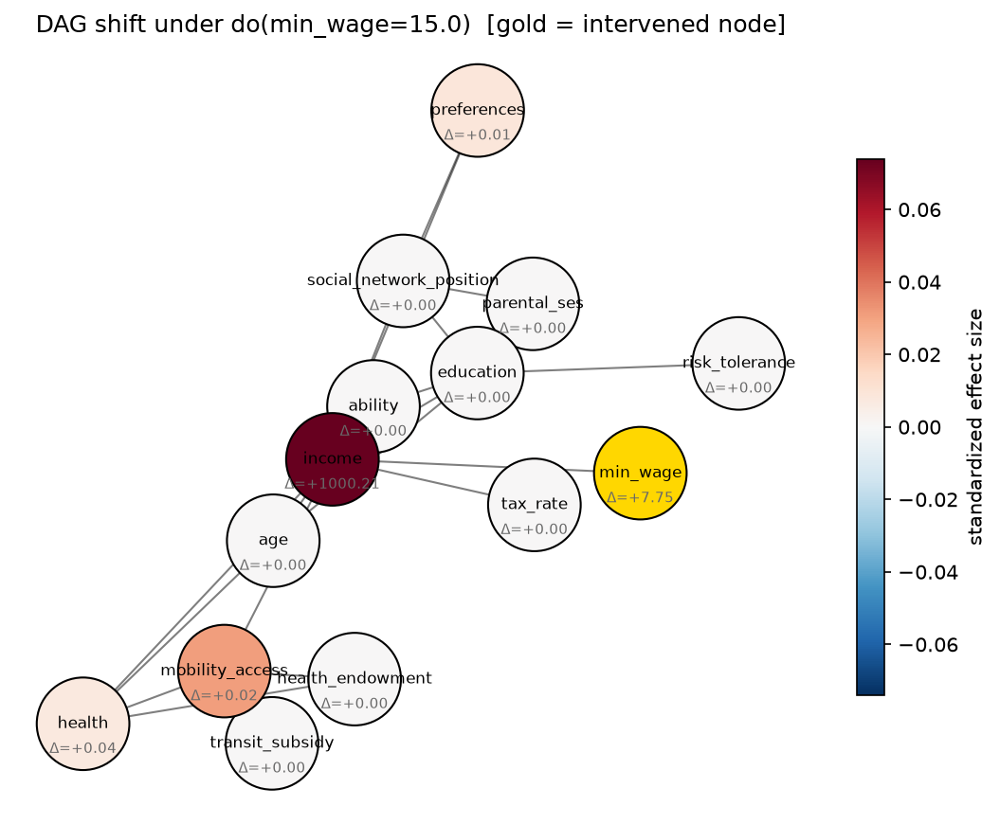
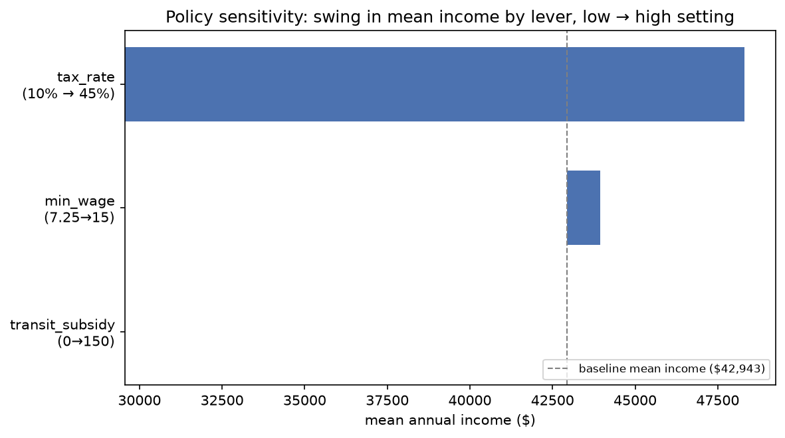
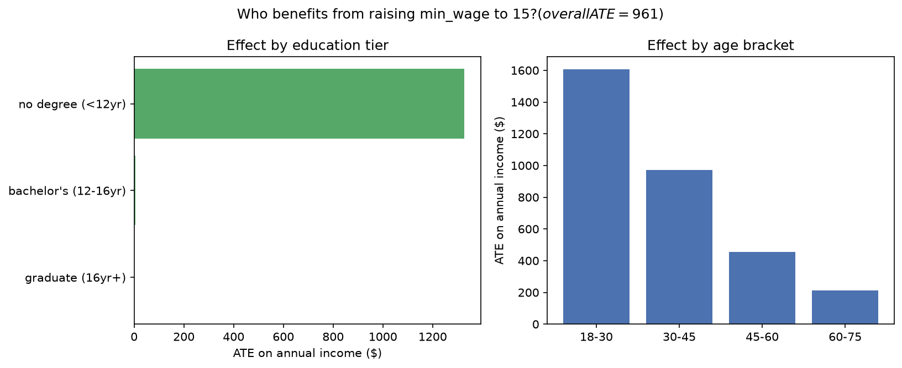
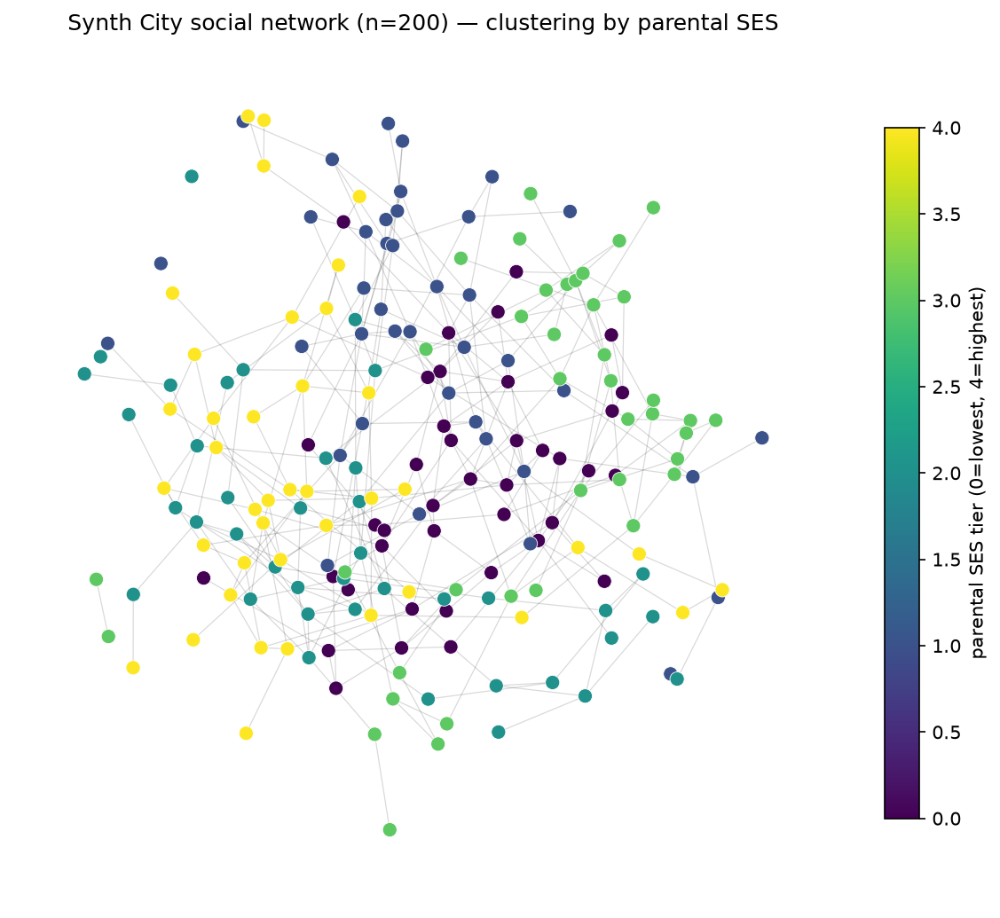
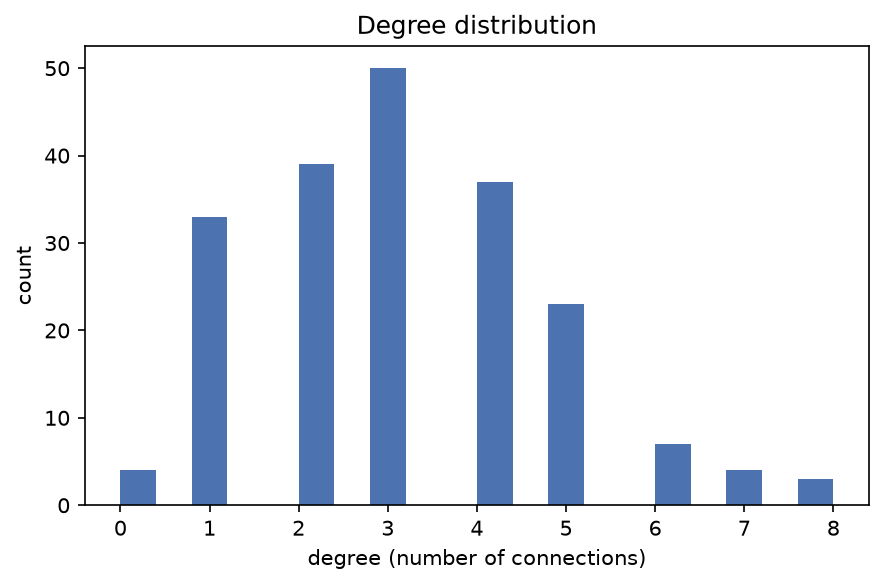

# What Happens to Society When the Minimum Wage Increases?

**Status:** ✅ Complete  
**Analysis:** [`minimum_wage_effect.py`](./minimum_wage_effect.py)

## Context

In real-world, higher wages may coincide with other economic changes, making it challenging to separate correlation from causation. SynthCity provides a unique benchmark: because every individual is generated from a Structural Causal Model (SCM), the same population can be simulated under different interventions while holding everything else constant. This allows the **true causal effect** of a minimum wage increase to be measured directly. Then, we can look at the impact of increasing the minimum wage on household income, employment, and related socioeconomic outcomes

This analysis examines how the minimum wage increase  propagate throughout the city's economy and which groups benefit the most.

## Experimental design

The intervention compares two otherwise identical cities:

- **Baseline city** Minimum wage = **\$7.25**
- **Intervention city:** Minimum wage = **\$15.00**

Simulation settings:

- Population: **5,000** residents
- Subgroup analysis: **20,000** residents (to improve estimate stability)
- Random seed: **0**
- Stability assessment: Average Treatment Effect (ATE) replicated across **20 independent simulations**

---

## Key Questions

1. **Overall Impact**
   - How much does household income change after the policy?

2. **Policy Sensitivity**
   - How do outcomes change as the minimum wage increases incrementally?

3. **Causal Spillover Effects**
   - Which downstream variables (health, mobility, spending, etc.) change as a consequence of higher wages?

4. **Distributional Effects**
   - Which demographic groups benefit the most, and which experience little or no change?


## Results

### 1. How much does household income change after the policy?




Raising the minimum wage from **$7.25/hour** to **$15.00/hour** increased the city's **mean annual income** from **$42,943.10** to **$43,943.31**, an average gain of +2.33%.
The estimated **Average Treatment Effect (ATE) was **$1,000.21**.

The intervention had its largest impact on lower-income workers. The **minimum annual income** increased from **$15,215.29** to **$31,200.00** (**+105.06%**), creating a clear concentration of individuals at the new minimum-income threshold. This shift indicates that the intervention primarily raised earnings at the lower end of the income distribution while leaving higher-income groups largely unchanged.

To assess the robustness of the estimated policy effect, the simulation was repeated across **20 independent random seeds**. The estimated **Average Treatment Effect (ATE)** was **$1,000.21** in the reference simulation (*n* = 5,000) and averaged **$981.36 ± $27.93** across all runs, demonstrating that the observed effect is highly stable.

### 2. Dose-response curve



Increasing the minimum wage produces a clear, positive increase in mean annual income across the citizens. The relationship is nonlinear: modest increases primarily benefit workers earning near the wage floor, while larger wage increases affect a broader share of the workforce, causing average income to rise more rapidly.

As the minimum wage approaches **$24–25/hour**, the citizens mean annual income exceeds **$52,000**, compared with the baseline average of **$42,943**. This illustrates how the intervention impact expands beyond the lowest-income workers as progressively more residents become directly affected.

### 3. How the Policy Propagates Through the City, spillover effect




Increasing the minimum wage directly raises **income**, which exhibits the largest effect following the intervention (red node). Those gains propagate to downstream outcomes, producing smaller but measurable improvements in **mobility access** and **health**. Characteristics such as  **education**, **ability**, and **parental socioeconomic status**—remain unchanged. This confirms that the intervention affects only variables downstream of the intervention.

### 4. Which lever matters most



Compared against the city's other two levers, `tax_rate` moves mean income roughly 5x more
than the full `min_wage` range does; `transit_subsidy` has zero effect on income (correct
by construction — it only feeds `mobility_access`, not `income`, in the SCM).

### 5. Who actually benefits



The effect is **entirely concentrated** in people without a college degree (the wage floor
only binds for people near it) and fades sharply with age (income rises with experience in
this model, pushing older workers further above the floor regardless of education).

## Headline numbers

| Metric | Value |
|---|---|
| True ATE (single sample, n=5,000) | $730.58 |
| True ATE (averaged over 20 seeds) | **$742.85 ± $23.51** |
| Swing in mean income, full `tax_rate` range | $19,256 |
| Swing in mean income, full `min_wage` range | $3,632 |
| ATE, no-degree subgroup | $1,016 |
| ATE, bachelor's/graduate subgroup | $0 |
| ATE, age 18-30 | $1,654 |
| ATE, age 60-75 | $161 |

## Interpretation

Reporting the single aggregate ATE ($743) would be technically correct and substantively
misleading on its own: it implies a modest, uniform effect, when the real story is a large
effect concentrated entirely in young, lower-education workers and zero effect on everyone
else. It also isn't the most powerful lever available — tax rate moves income roughly 5x
more per unit of policy range swept. The practical takeaway for a policymaker optimizing for
income alone: tax rate is the bigger lever, but minimum wage is the more *targeted* one.


# Social Network Structure: How Much Does Background Sort People?

## Objective

The social network in Synth City is generated to be homophilous on parental socioeconomic
status (SES) — people connect more with others from a similar background. How strong is
that effect visually and numerically, and is it strong enough to matter for downstream
questions (e.g. job-referral effects on income)?

## Method

- **Population:** n = 400 (kept small deliberately — a force-directed layout of thousands
  of nodes is an unreadable hairball, not an insight)
- Social graph built via stochastic block model, blocked on parental SES quintile
- Homophily measured as: share of edges connecting two people in the *same* SES tier,
  compared to the ~20% you'd expect if connections formed randomly across 5 equal-sized tiers

## Key results



The five SES tiers visibly separate into distinct regions of the graph — you can identify a
person's socioeconomic tier from their position in the network almost as reliably as from
the color legend itself.



## Headline numbers

| Metric | Value |
|---|---|
| Nodes / edges | 400 / 1,257 |
| Average clustering coefficient | 0.039 |
| Share of edges within the same SES tier | **80.3%** (vs. ~20% under random mixing) |

## Interpretation

80% same-tier connectivity against a 20% random baseline is strong, deliberate homophily —
exactly what the generator was built to produce, and a useful confirmation that the social
graph isn't accidentally closer to a random (Erdős–Rényi) graph, which would defeat the
point of including a network at all. This matters beyond aesthetics: `social_network_position`
feeds directly into `income` in the SCM, so this clustering is *why* SES has an indirect path
to income beyond the direct one — a second confounding channel worth being aware of before
trusting any naive regression estimate of `education → income`.


## Reproduce

```bash
python quantitative_analysis/causal-inference/direct-intervention-effects/minimum_wage_effect.py
```
