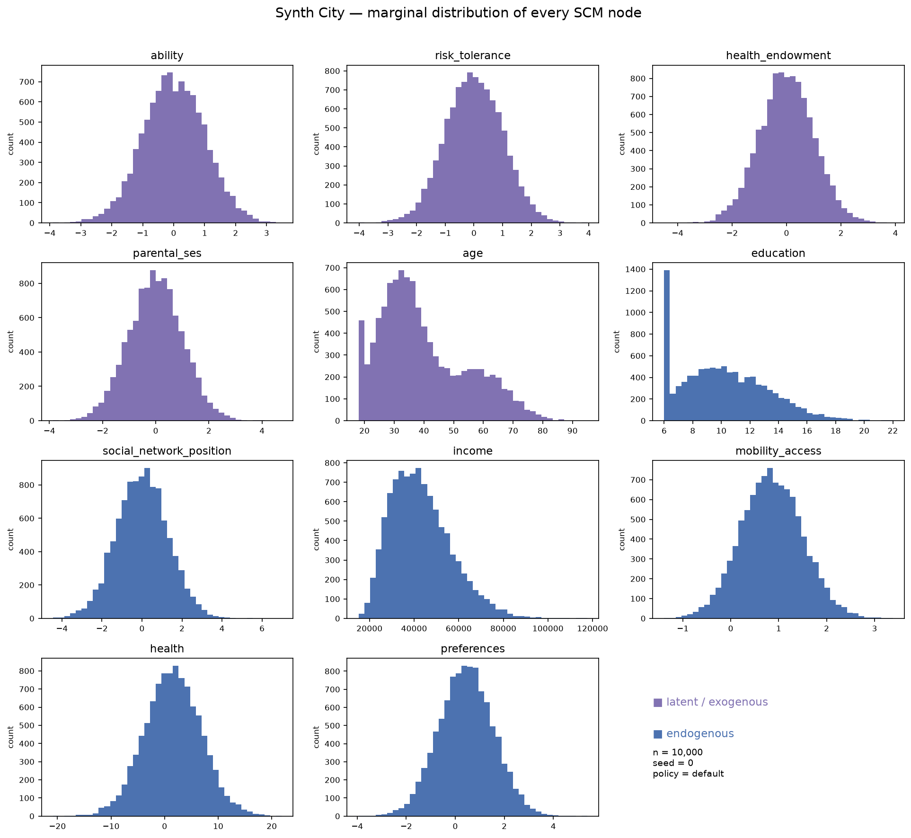
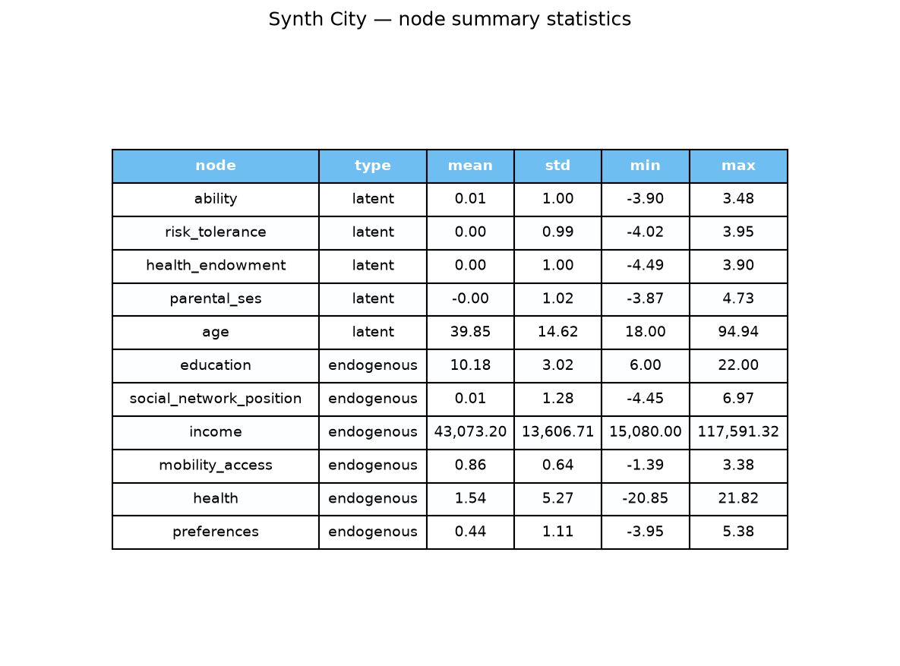

# City structural causal model

A visual tour of every variable in the Synth City structural causal model; useful both as a "what does this world actually look like" overview and as a sanity check whenever a structural equation in nodes.py changes 

Script: synth_city_details.py 
Population: n = 10,000, seed = 0, default policy





## Notes

Variable-by-variable, what each distribution actually is and what it's measured in:

- **`ability`, `risk_tolerance`, `health_endowment`, `parental_ses`** — latent, standard
  normal, unitless (z-score scale by construction, mean 0 / std 1). These are pure inputs,
  not measured in any real-world unit — think of them as standardized traits.

- **`age`** — years, range [18, 75]. Meant to look like a population pyramid  

- **`education`** — years of schooling, range [6, 22], mean ≈ 10.2, std ≈ 3.0. 

- **`social_network_position`** — standardized score, unitless, mean ≈ 0, std ≈ 1.3.
  Roughly normal-shaped, no clipping, so no boundary artifacts.

- **`income`** — EU (euros) (annual), mean ≈ $43,061, std ≈ $13,595, range
  [$15,080, $116,295]. **This changed materially**: noise is now multiplicative lognormal
  rather than additive normal,  The floor
  (`min_wage × 2080`) still sets the hard minimum at $15,080, but the long right tail out to
  $116k is new — lognormal noise, unlike normal noise, can multiply a high base income into
  a much larger draw, which is exactly the kind of tail real income distributions have.

- **`mobility_access`** — standardized score, unitless, mean ≈ 0.86, std ≈ 0.64. Roughly
  normal, no clipping.

- **`health`** — standardized score, unitless, mean ≈ 1.54, std ≈ 5.27 — the widest relative
  spread of any endogenous node. It's downstream of three separately noisy nodes
  (`health_endowment`, `income`, `mobility_access`), so variance compounds with each hop
  rather than averaging out.

- **`preferences`** — standardized score, unitless, mean ≈ 0.44, std ≈ 1.11. Roughly normal.




## Reproduce

```bash
python3 quantitative_analysis/ds/synth_city_details.py
```
